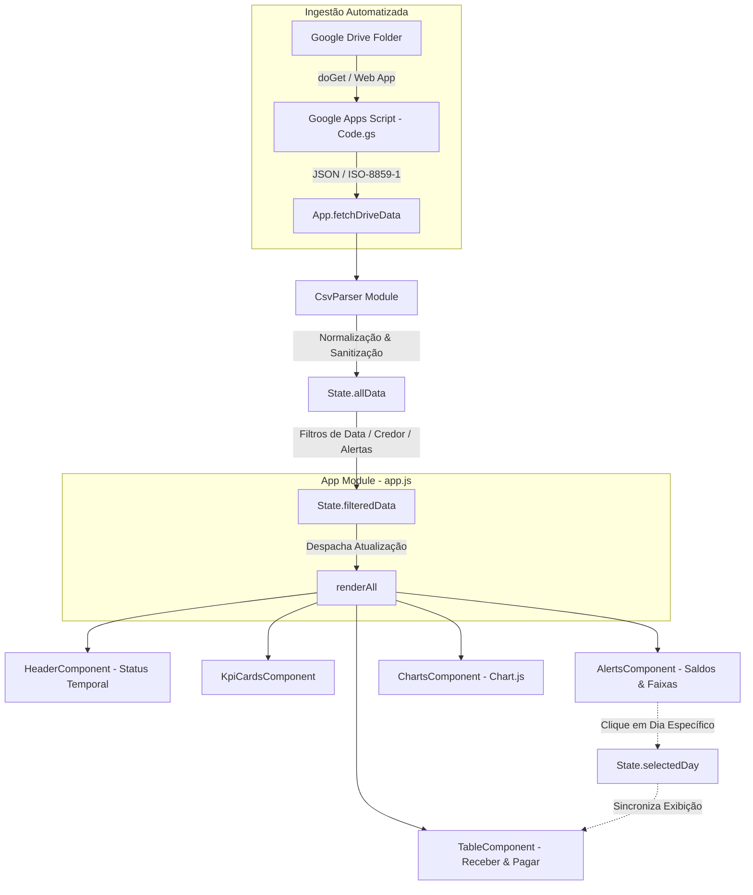

# Documentação Técnica do Projeto
## Condomínio Agrícola Familiar Bachinski — Gestão Financeira & Fluxo de Caixa

---

### Sumário Executivo
- **Projeto**: Dashboard de Gestão Financeira e Fluxo de Caixa
- **Organização**: Condomínio Agrícola Familiar Bachinski
- **Arquitetura**: Single Page Application (SPA) Client-Side Modular
- **Stack Principal**: HTML5, CSS3 Moderno (Vanilla com CSS Variables), JavaScript ES6+ (Sem frameworks pesados)
- **Bibliotecas Externas**: PapaParse v5.4.1, Chart.js v4.4.0, ChartDataLabels v2.2.0, Google Fonts (Inter & Roboto Mono)
- **Persistência**: LocalStorage (Configurações visuais, preferências de tema e paleta de cores)
- **Versionamento**: SemVer 2.0.0 (`v2.5.0`), documentado em `CHANGELOG.md`
- **Mecanismo de Cache**: Versionamento de query string (`?v=2.7`)

---

## 1. Visão Geral e Objetivos do Sistema

O sistema é uma aplicação web de inteligência financeira projetada para atender às demandas de controle de liquidez, acompanhamento de contas a pagar e a receber, monitoramento de vencimentos críticos e conciliação de saldos diários.

### Principais Objetivos
1. **Autonomia Operacional**: Operação *client-side*, permitindo execução em servidores estáticos locais ou em nuvem (ex.: GitHub Pages, AWS S3, Nginx) com carregamento instantâneo.
2. **Ingestão 100% Automatizada**: Sincronização direta via API do Google Apps Script com a pasta designada no Google Drive, capturando automaticamente a base CSV mais recente sem intervenção manual.
3. **Visão Executiva & Operacional Integrada**:
   - Monitoramento de saúde do arquivo e defasagem temporal no cabeçalho.
   - KPIs consolidados em tempo real.
   - Esteira temporal de alertas de vencimento com âncora dinâmica na data corrente.
   - Painel de saldos diários com cálculo de saldo acumulado (*running balance*).
   - Segregação de Contas a Receber e Contas a Pagar com drill-down por data.
   - Histograma de desembolsos programados por vencimento com escala ajustável.

---

## 2. Arquitetura de Software e Fluxo de Dados

A aplicação adota o padrão arquitetural **Component-Based Modular Vanilla**, estruturado com gerenciamento centralizado de estado através de um padrão **Store/Singleton**.



### 2.1 Ciclo de Vida da Aplicação
1. **Inicialização (`App.init()`)**:
   - Carregamento de temas salvos via `localStorage` (Dark/Light).
   - Registro de plugins do Chart.js (`ChartDataLabels`).
   - Montagem do layout estrutural via injeção nos contêineres do DOM (`header-container`, `kpi-container`, etc.).
   - Disparo imediato de `App.fetchDriveData()`.
2. **Sincronização & Processamento (`App.fetchDriveData` / `CsvParser.parse`)**:
   - Consulta à URL do Google Apps Script (`State.driveApiUrl`).
   - Validação temporal da última modificação do arquivo em relação à data corrente do sistema.
   - Parsing numérico e de datas com suporte a padrões brasileiros (`DD/MM/YYYY` e `1.234,56`).
3. **Filtragem e Renderização Reativa (`App.applyFilters` / `App.renderAll`)**:
   - Os filtros ativos de data inicial, data final, credor/cliente selecionado e alertas temporais são combinados.
   - Os dados resultantes (`State.filteredData`) são distribuídos para todos os componentes de visualização.

---

## 3. Estrutura de Arquivos e Módulos

A estrutura do projeto é rigorosamente modularizada em responsabilidades únicas:

```
├── index.html                   # Documento raiz principal da aplicação
├── dashboard.html               # Espelho de index.html para rotas alternativas
├── google-apps-script/          # Backend Serverless Google Drive API
│   └── Code.gs                  # Web App doGet(): varredura do CSV mais recente e resposta CORS JSON
├── css/                         # Camada de estilos (Design System)
│   ├── main.css                 # Variáveis CSS, reset, loading bar e layout do dashboard
│   ├── header.css               # Estilos da identidade institucional, badge de saúde e combobox
│   ├── kpis.css                 # Estilos dos 4 cards executivos
│   ├── alerts.css               # Faixas de alertas e tabela de saldos diários
│   ├── table.css                # Cards de Contas a Receber e Contas a Pagar
│   └── charts.css               # Gráficos, ferramentas de cores e alças de redimensionamento
└── js/                          # Camada de lógica e scripts modulares
    ├── app.js                   # Orquestrador central e sincronização com Google Drive (fetchDriveData)
    ├── state.js                 # Armazenamento e estado compartilhado (fileMetadata e driveApiUrl)
    ├── csv-parser.js            # Mecanismo de parsing, limpeza e normalização do CSV
    ├── utils.js                 # Utilitários de formatação de moedas, datas e cores
    └── components/              # Componentes de interface independentes
        ├── header.js            # Cabeçalho, badges de status, botões de ação e alternador de tema
        ├── kpi-cards.js         # Cards com valores e contadores agregados
        ├── alerts.js            # Alertas temporais e Tabela de Saldos Diários
        ├── table.js             # Módulos de Contas a Receber (topo) e a Pagar (base)
        └── charts.js            # Gráficos de barras Chart.js com redimensionamento
```

---

## 4. Dicionário de Dados e Normalização

O módulo [csv-parser.js](file:///c:/Users/gabriel.dore/Documents/Pojetinho/PowerBi/js/csv-parser.js) analisa os cabeçalhos de entrada de forma resiliente, aceitando variações de nomenclatura (ex.: "venc", "vencimento", "emiss", "emission", "credor", "creditor").

### Estrutura do Objeto Transacional (`TransactionRecord`)

| Campo | Tipo | Descrição | Regra de Normalização |
| :--- | :--- | :--- | :--- |
| `parcela` | `string` | Identificador do documento ou parcela | Normalizado com `.trim()` |
| `emissao` | `Date \| null` | Data de emissão da obrigação | Convertido via `Utils.parseDate` |
| `vencimento` | `Date` | Data de vencimento do título | Obrigatório; registros sem data são descartados |
| `credor` | `string` | Nome do favorecido ou cliente pagador | Normalizado com `.trim()` |
| `historico` | `string` | Descrição contábil/operacional do lançamento | Preserva detalhes originais |
| `entrada` | `number` | Valor do crédito (recebimento) | Convertido para float positivo (`Utils.parseNum`) |
| `saida` | `number` | Valor do débito (desembolso) | Convertido para float positivo (`Utils.parseNum`) |
| `saldo` | `number` | Saldo bruto fornecido no extrato | Opcional / Referência |
| `liquido` | `number` | Impacto líquido do lançamento | Calculado: `entrada - saida` |

---

## 5. Detalhamento dos Componentes

### 5.1 Cabeçalho & Filtros Avançados (`HeaderComponent`)
- **Branding Institucional**: Logotipo personalizado com as cores e tipografia do *Condomínio Agrícola Familiar Bachinski*.
- **Filtro de Período**: Seletores de data nativos com ativação de popover em qualquer clique (`showPicker()`) mantendo compatibilidade com digitação manual.
- **Combobox Pesquisável de Credores**:
  - Busca em tempo real com normalização *case-insensitive*.
  - Navegação por teclado (`Escape` para fechar, `Enter` para selecionar o primeiro resultado).
  - Botão de limpeza rápida (`✕`) e clique externo automático para fechar.
- **Alternador de Tema (Dark / Light)**:
  - Alternância de classes no elemento `body` (`body.light-theme`).
  - Atualização dos tokens de cor do Chart.js para manter contraste e legibilidade.

### 5.2 Cards de Indicadores Executivos (`KpiCardsComponent`)
- **Total Entradas**: Soma de `r.entrada`, com subtítulo exibindo a contagem de lançamentos de crédito.
- **Total Saídas**: Soma de `r.saida`, com subtítulo exibindo a contagem de lançamentos de débito.
- **Resultado Líquido**: Diferença consolidada (`Total Entradas - Total Saídas`), com marcador visual dinâmico (▲ saldo positivo / ▼ saldo negativo).
- **Qtd. Lançamentos**: Volume total de títulos no escopo filtrado.
- **Recálculo Dinâmico por Seleção Diária**: Ao selecionar um dia específico na tabela de Saldos Diários ou no gráfico, os 4 cards recalculam instantaneamente para expressar os totais daquele dia, exibindo banner de escopo ativo com atalho para restaurar os totais do período completo.

### 5.3 Alertas de Vencimento e Saldos Diários (`AlertsComponent`)
- **Faixas de Alerta Dinâmicas**:
  - Âncora baseada na data atual local (`00:00:00`).
  - Faixas: **Vencidos** (passados), **Vence Hoje** (dia atual), **Próximos 7 dias**, **Próximos 30 dias**.
  - O clique em qualquer faixa filtra instantaneamente a visualização global nos registros correspondentes.
- **Tabela de Saldos Diários**:
  - Agrupamento das transações do período filtrado por dia de vencimento.
  - Exibição de: Dia da semana (destaque "Hoje" em âmbar), Data formatada (`DD/MM/YYYY`), Créditos do dia, Débitos do dia e **Saldo Acumulado (*Running Balance*)**.
  - **Interatividade Drill-Down**: Clicar em uma linha de saldo define `State.selectedDay`, filtrando automaticamente as listas de Contas a Receber e Pagar exclusivamente para o dia selecionado.
  - Botão inline e de cabeçalho para remoção da seleção diária (`selectDay(null)`).

### 5.4 Contas a Receber e Contas a Pagar (`TableComponent`)
- **Segregação Visual**:
  - Card Superior: **Contas a Receber** (entradas em verde).
  - Card Inferior: **Contas a Pagar** (saídas em vermelho).
- **Sincronização**: Reflete a seleção diária do módulo de saldos ou exibe todos os títulos do período geral.
- **Inativação / Reativação por Clique**:
  - Clique direto em qualquer linha para inativar a movimentação (adiciona efeito visual de traço cinza *line-through*, opacidade reduzida e tag `Inativado`).
  - O valor do item inativado é automaticamente deduzido de todos os totais (card, KPIs, saldos diários e histograma).
  - Clique na linha inativada para reativá-la imediatamente.
  - Botão de rodapé `↺ Reativar` para restauração em lote.
- **Estrutura de Linha**: Documento / Parcela, Favorecido com tooltip de texto longo, Descrição/Histórico, Data de Vencimento e Valor formatado em BRL.
- **Rodapé Agregador**: Exibe a contagem de títulos ativos, quantidade de inativados e o valor total acumulado do grupo.

### 5.5 Gráfico de Desembolsos Programados (`ChartsComponent`)
- **Visualização**: Gráfico de colunas agrupadas por dia de vencimento, comparando Entradas vs. Saídas.
- **Rótulos de Dados**: Plugin `ChartDataLabels` formatando valores no topo das barras em notação compacta (`K` / `M`).
- **Personalização de Cores**:
  - Seletor de cores predefinidas (Vermelho Carmim, Laranja Tigre, Azul Oceano, Roxo Real, Turquesa).
  - Seletor nativo `input[type="color"]` para livre escolha cromática.
  - Persistência instantânea no `localStorage` sob a chave `fc_colunas_color`.
- **Controle de Dimensões**:
  - Layout *full-width* na base do dashboard.
  - Alça vertical inferior (`resize: vertical`) gerenciada com `ResizeObserver` para re-renderização responsiva do canvas sem distorção gráfica.

---

## 6. Design System & Temas

O projeto utiliza um design system construído em CSS puro, sem sobrecarga de frameworks como Tailwind ou Bootstrap, garantindo performance e renderização imediata.

### Tokens de Cores Globais

```css
:root {
  /* Modo Escuro (Padrão) */
  --bg-main: #0D1B2A;
  --bg-panel: #1E2D3D;
  --bg-alt: #162330;
  --border: #2E4A6B;
  --green: #2ECC71;
  --red: #E74C3C;
  --blue: #3498DB;
  --amber: #F39C12;
  --white: #FFFFFF;
  --gray: #A0B0C0;
  
  /* Tipografia */
  --font-main: 'Inter', sans-serif;
  --font-mono: 'Roboto Mono', monospace;
  
  /* Raios de Borda */
  --radius: 12px;
  --radius-sm: 8px;
}

body.light-theme {
  /* Modo Claro */
  --bg-main: #F1F5F9;
  --bg-panel: #FFFFFF;
  --bg-alt: #F8FAFC;
  --border: #CBD5E1;
  --white: #0F172A;
  --gray: #64748B;
  --blue: #2563EB;
}
```

---

## 7. Persistência de Dados e Estado Local

A aplicação não utiliza cookies ou dados de sessão temporários, garantindo privacidade e integridade:

| Chave `localStorage` | Descrição | Valores Possíveis | Padrão |
| :--- | :--- | :--- | :--- |
| `fc_theme` | Tema de interface do usuário | `'dark'` \| `'light'` | `'dark'` |
| `fc_colunas_color` | Cor das barras de Saídas no gráfico | Código Hexadecimal (`#E74C3C`, etc.) | `'#E74C3C'` |
| `fc_barras_color` | Cor secundária reservada | Código Hexadecimal | `'#F39C12'` |

---

## 8. Segurança e Tratamento de Exceções

1. **Higienização de Entradas (XSS & Injeção)**:
   - Os dados do CSV são inseridos na interface através de nós de texto seguros (`textContent`) ou templates interpolados com sanitização de tipos.
2. **Resiliência a Falhas de Formatação**:
   - Casos de valores nulos, vazios ou campos textuais em colunas monetárias são neutralizados por `Utils.parseNum` (retornando `0`).
   - Datas com formatos atípicos retornam `null` e não quebram o pipeline de execução.
3. **Privacidade e Governança**:
   - Nenhum registro financeiro ou dado pessoal sai do navegador do usuário. Toda a manipulação permanece local na memória RAM do cliente.

---

## 9. Como Executar e Implantar

### Execução Local
Por ser uma aplicação baseada em padrões web padrão, basta servir a pasta raiz com qualquer servidor web HTTP:

- **Via Python 3**:
  ```bash
  python -m http.server 8080
  ```
- **Via Node.js (npx serve)**:
  ```bash
  npx serve .
  ```
- **Via VS Code / IDE**:
  - Utilizar a extensão **Live Server** abrindo o arquivo `index.html`.

### Deploy em Produção
- O repositório está pronto para deploy contínuo em serviços de hospedagem estática como **GitHub Pages**, **Vercel**, **Cloudflare Pages** ou **Netlify**. Basta configurar a raiz do repositório como diretório de publicação.
